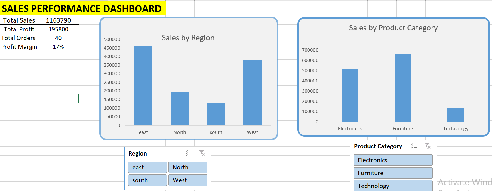

# Advanced Excel Sales Performance Dashboard

## 📊 Project Overview
This project is an advanced interactive Sales Performance Dashboard built using Microsoft Excel.  
It transforms structured sales data into meaningful business insights using KPIs, Pivot Tables, Pivot Charts, and Slicers.

The dashboard enables dynamic filtering and comparative analysis across regions and product categories.

---

## 🛠 Tools & Techniques Used
- Microsoft Excel
- Pivot Tables
- Pivot Charts
- Slicers
- KPI Metrics
- Data Cleaning & Structuring
- Dashboard Design

---

## 📈 Key Features
- Region-wise Sales Analysis
- Product Category Comparison
- Interactive Slicers
- Automated KPI Calculations
- Clean and Professional Dashboard Layout

---

## 📊 KPIs Included
- Total Sales
- Total Profit
- Total Orders
- Profit Margin (%)

---

## 🖼 Dashboard Preview

---

## 📂 Files Included
- Advanced_Excel_Sales_Dashboard.xlsx
- Advanced_Sales_Performance_Dashboard_Report.pdf
- Dashboard_Screenshot.png

---

## 🎯 Skills Demonstrated
- Data Analysis in Excel
- Multi-Pivot Integration
- Business KPI Engineering
- Interactive Dashboard Development
- Professional Documentation

---

## 🚀 Conclusion
This project demonstrates my ability to design professional, interactive Excel dashboards and extract actionable insights from structured datasets.

I am continuously enhancing my analytical and visualization skills by building more advanced data-driven projects.
